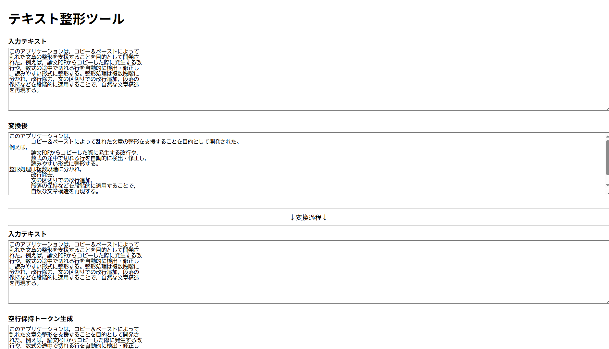

# 長い文章を良い感じに整形して読みやすくするやつ

文章をコピペすると自動的に整形してくれます。
PDF からの文章のコピペ時に発生する改行を除去し、文の区切りで改行し直します。

🔗: https://summer498.github.io/document-format/

---

## 処理内容

- 改行の除去
- 空行（段落）を保持
- ピリオド・句点ごとに改行挿入
- カンマ・読点での句切り＋インデント整形
